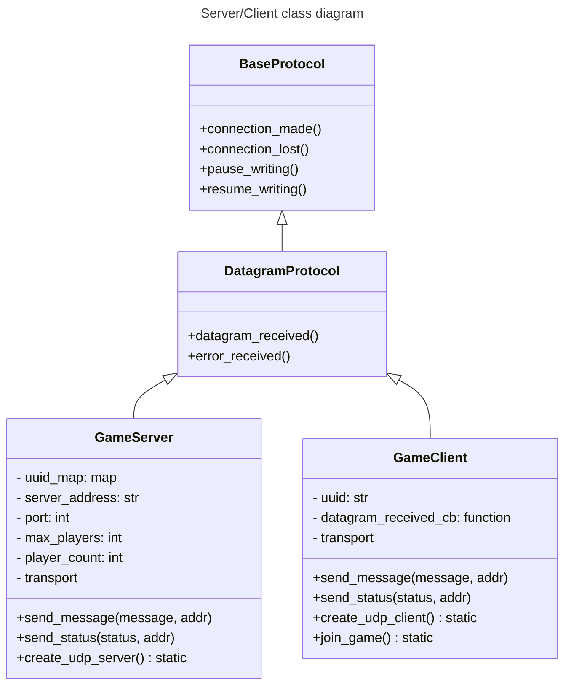
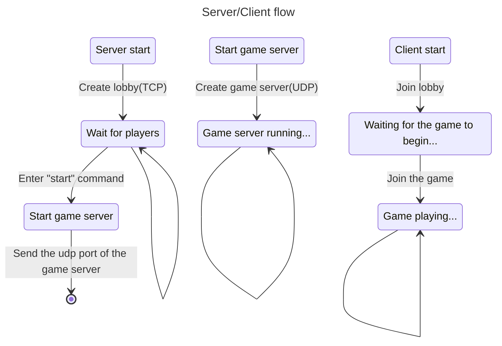
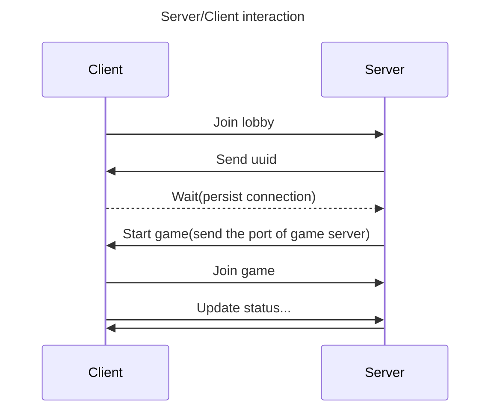
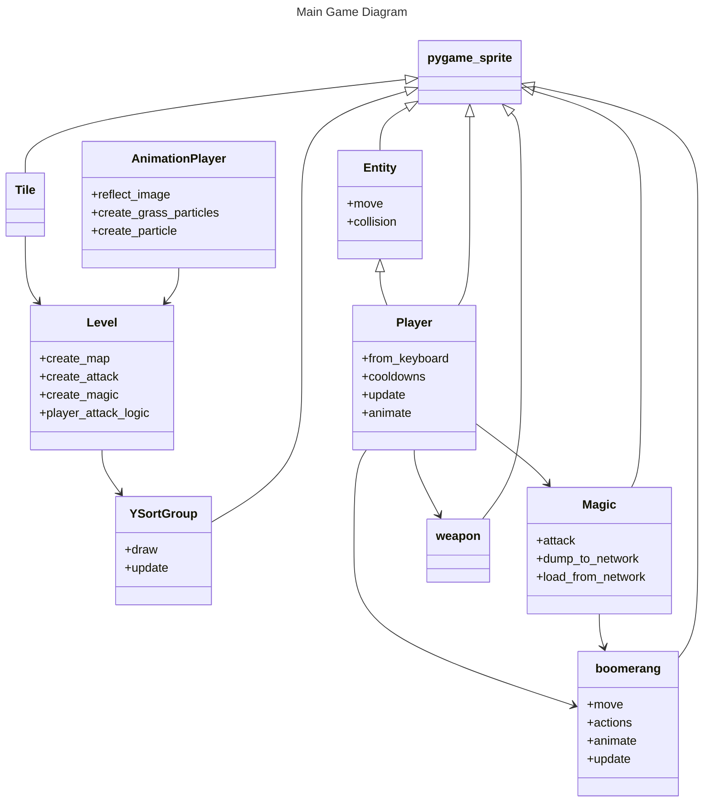

## Group 6 AOOP Project
This repository aims to create a clone of Boomerang Fu using Pygame.

- Objective
    - Movement    
        - Flash
    - Weapons
        - Melee
            - Auto-attack      
        - Projectile
            - Boomerang     
            - Normal projectile
    - Obstacle/Collision
    - Multiplayer
    <!-- - Environment
        - Death
        - Respawn (?)
    - Menu
    - UI(might be rough or just CLI) -->

### Install dependencies
```sh
$ pip install -r requirements.txt
```

### Play locally(2 players)
```sh
$ python main.py
```

### Start a server
```sh
$ python server.py [--max-players MAX_PLAYERS] [--host HOST] [--port PORT]
```
Wait until all players join the server, then enter `start` to initiate the game server.

### Join a server 
```sh
$ python main.py -m [--host HOST] [--port PORT]
```

<!-- ### Starter Kit 
We forked these references in our organization.  

This project use '15 - fixes audio' from [Zelda](https://github.com/clear-code-projects/Zelda) as the starter kit.   -->

### Tools / packages used
- pygame
- asyncio (for networking)
- ZeroTier (for LAN networking)

<!-- ### To-dos
- [x] Skeleton
- [x] Description of this project
- [x] Single-player mode
- [x] Multiplayer connectivity
- [ ] UML diagram -->
<!-- - [ ] UI
- [ ] meet PEP8 / add docstring / write tests -->

### Server/Client Class & Architecture 








